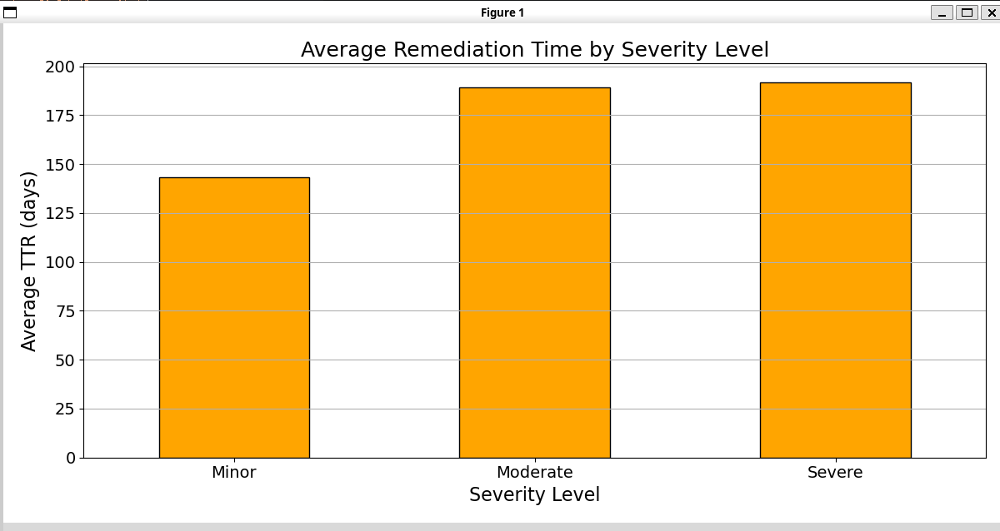

# AppSec KPI Calculator

A Python script to calculate key performance indicators (KPIs) for application security (AppSec) from a CSV file containing vulnerability data.

## Description

This script provides a flexible way to calculate essential AppSec KPIs such as:
- **NACV**: Number of Active Critical Vulnerabilities
- **TTR**: Average Time to Remedy
- **NVT**: Number of Vulnerabilities per Team
- **TTRC**: Average Time to Remedy per Criticity

It is designed to work with CSV files exported from issue tracking systems like Jira, allowing security teams to measure and improve their vulnerability management processes.

## Installation

1. Ensure you have Python 3 installed on your system.
2. Install the required dependencies using pip:
   ```bash
   pip install pandas matplotlib
   ```

## Usage

Run the script from the command line, specifying the desired KPI and the path to your CSV file. You can also customize column names if they differ from the defaults.

```bash
python3 kpi.py <KPI> <csv_file> [options]
```

### Available KPIs
- `NACV`: Number of Active Critical Vulnerabilities
- `TTR`: Average Time to Remedy
- `NVT`: Number of Vulnerabilities per Team
- `TTRC`: Average Time to Remedy per Criticity

### Options
- `--priority-col`: Name of the priority column (default: 'Priority')
- `--status-col`: Name of the status column (default: 'Status')
- `--created-col`: Name of the created date column (default: 'Created')
- `--resolved-col`: Name of the resolved date column (default: 'Resolved')
- `--severity-col`: Name of the severity column (default: 'Custom field (Severity)')
- `--team-col`: Name of the team column (default: 'Custom field (Squad Plataforma)')
- `--exclude-teams`: Teams to exclude from NVT calculation (default: 'None', 'Dev Ops', 'Sistema de Diseño')

For a full list of options, run:
```bash
python3 kpi.py --help
```

## Examples

1. Calculate the Number of Active Critical Vulnerabilities (NACV):
   ```bash
   python3 kpi.py NACV all-issues.csv
   ```

2. Calculate the Average Time to Remedy (TTR) with custom column names:
   ```bash
   python3 kpi.py TTR all-issues.csv --created-col "Creation Date" --resolved-col "Resolution Date"
   ```

3. Calculate the Number of Vulnerabilities per Team (NVT), excluding specific teams:
   ```bash
   python3 kpi.py NVT all-issues.csv --team-col "Assigned Team" --exclude-teams "Team A" "Team B"
   ```

4. Calculate the Average Time to Remedy per Criticity (TTRC):
   ```bash
   python3 kpi.py TTRC all-issues.csv --severity-col "Severity Level"
   ```

#### Important:
- Ensure your CSV file has the required columns for the selected KPI.
- Dates should be in a format recognizable by pandas (e.g., 'YYYY-MM-DD').
- For NVT, teams can be excluded to focus on relevant teams only.

## Example of use

```bash
grunt@grunt:/mnt/c/Users/Grunt/Documents/GitHub/AppSec-KPI-metrics$ python3 kpi.py TTRC vulnerability_test_data.csv --created-col "Date Created" --resolved-col "Date Resolved" --severity-col "Severity Level"

    ___               _____              __  ___     __       _
   /   |  ____  ____ / ___/___  _____   /  |/  /__  / /______(_)_________
  / /| | / __ \/ __ \\__ \/ _ \/ ___/  / /|_/ / _ \/ __/ ___/ / ___/ ___/
 / ___ |/ /_/ / /_/ /__/ /  __/ /__   / /  / /  __/ /_/ /  / / /__(__  )
/_/  |_/ .___/ .___/____/\___/\___/  /_/  /_/\___/\__/_/  /_/\___/____/
      /_/   /_/

Made by grunt.ar

/mnt/c/Users/Grunt/Documents/GitHub/AppSec-KPI-metrics/kpi.py:88: SettingWithCopyWarning: 
A value is trying to be set on a copy of a slice from a DataFrame.
Try using .loc[row_indexer,col_indexer] = value instead

See the caveats in the documentation: https://pandas.pydata.org/pandas-docs/stable/user_guide/indexing.html#returning-a-view-versus-a-copy
  valid_dates['Remediation Time'] = (valid_dates[resolved_col] - valid_dates[created_col]).dt.days

Average remediation time by severity:
Severity Level
Minor       143.29
Moderate    189.00
Severe      191.77
Name: Remediation Time, dtype: float64

``` 

- 